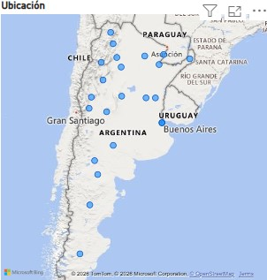
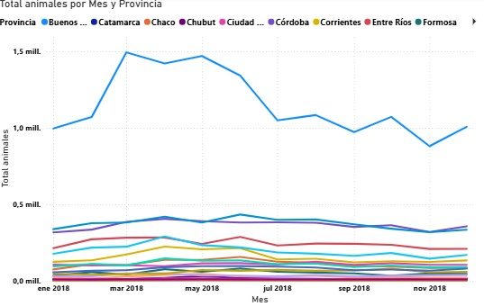

# Proyecto ETL y Dashboard de Movimientos Bovinos en Argentina

Este proyecto implementa un **pipeline ETL (Extract, Transform, Load)** para procesar datos de movimientos bovinos en Argentina y generar un conjunto de datos agregado que luego se visualiza en un dashboard interactivo.

El objetivo del proyecto es analizar los movimientos de ganado bovino entre provincias y detectar patrones geográficos y temporales.

---

# Tecnologías utilizadas

- Python  
- pandas  
- Power BI  
- Git y GitHub  

El procesamiento de datos se realiza con la librería **pandas** y el dashboard fue construido en **Microsoft Power BI**.

---

# Estructura del proyecto

```
MOVIMIENTOS-BOVINOS-ETL
│
├── Dashboard
│ ├── dashboard.pbix
│ └── screenshots
│
├── data
│ ├── raw
│ └── processed
│
├── src
│ ├── extract.py
│ ├── transform.py
│ └── main.py
│
├── requirements.txt
└── README.md
```

---

# Pipeline ETL

El proyecto sigue las etapas clásicas de un proceso **ETL**.

## 1. Extract (Extracción)

Se carga el dataset original en formato CSV desde la carpeta:


data/raw


El script `extract.py` se encarga de leer el archivo y cargarlo en un DataFrame.

---

## 2. Transform (Transformación)

En esta etapa se realizan diferentes transformaciones sobre los datos:

- Limpieza de datos  
- Creación de variables temporales  
- Preparación del dataset para análisis  

Estas transformaciones se implementan en el archivo:


src/transform.py


---

## 3. Aggregate (Agregación)

Los datos se agregan para obtener:

- **Total de animales movidos**
- **Por provincia de origen**
- **Por mes**

Esto permite analizar patrones de movimientos bovinos a lo largo del tiempo.

---

## 4. Load (Carga)

El dataset final se guarda en:


data/processed/movimientos_bovinos_mensual_provincia.csv


Este archivo es utilizado posteriormente para la visualización en Power BI.

---

# Ejecución del proyecto

Para ejecutar el pipeline ETL:

### 1. Instalar las dependencias


pip install -r requirements.txt


### 2. Ejecutar el script principal


python src/main.py


Esto generará el dataset procesado dentro de la carpeta:


data/processed


---

# Dashboard

Los datos procesados se visualizan mediante un dashboard interactivo creado en Power BI.

El dashboard permite analizar:

- Movimientos bovinos por provincia
- Distribución geográfica del ganado
- Evolución temporal de los movimientos

---

# Vista general del dashboard


---

# Distribución geográfica de movimientos bovinos



---

# Evolución mensual de movimientos



---

# Posibles insights

A partir del análisis se pueden observar:

- Provincias con mayor movimiento de ganado bovino
- Distribución geográfica del transporte de animales
- Patrones temporales en los movimientos bovinos

---

# Autor
Rojas Sebastián.
Proyecto desarrollado como parte de un portafolio de análisis de datos.